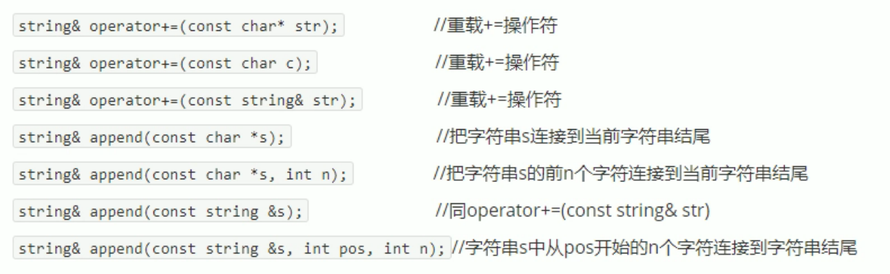
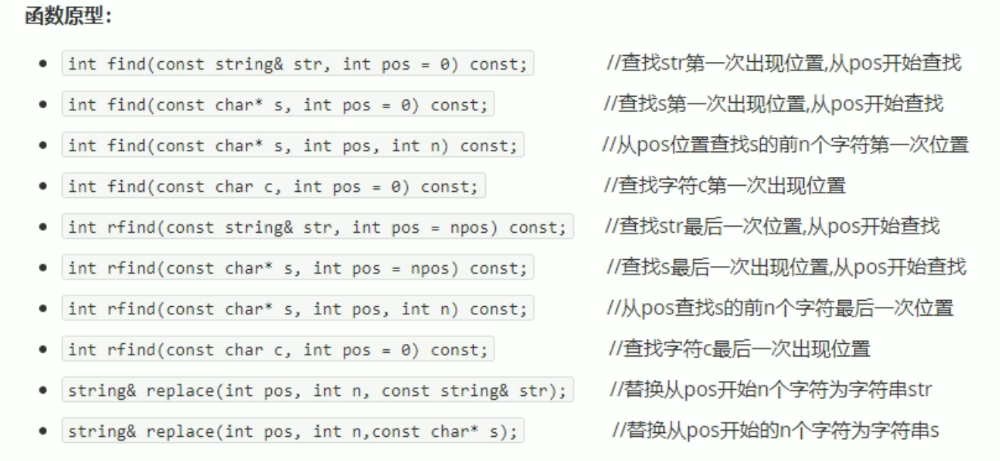

``` c++
// string是一个类  构造函数 

string();
string(const char*s);


//赋值操作            "asdasda"  
string& operator=(const char*s);  //Char*类字符串 赋值给当前的字符串                  str2
string& operator=(const string &S);//把字符串s赋给当前的字符串

string&assign(const char*s);
string str4;
str4.assign("asdasd");
str4.assign("asdasd",2);
```



```c++
//字符串拼接
string str1 ="1";
str1 +="asd";
str3.append("asdasd");
```




```c++
//查找和替换
str1.find();//默认从0开始找  有的话返回下标

str1.repalce(1,3,str2);//从哪到哪替换成什么
```


```c++
//字符串比较  比较ascii码
str1.compare()

    
//字符存取
//通过[]访问单个字符
for(int i=0;i<str.size();i++)
{
    cout<<str[i]<<"";
}
//通过at方法访问单个字符
str.at(1);
```


```c++
//插入和删除
#include<iostream>
using namespace std;
#include<string>
string str1 ="123";
//         插入位置
str1.insert(1,"asdasd");
//删除
str1.erase(1,4);
```


```c++
//截取子串
string str="abcdef";
string substr=str.substr(1,3);
```

